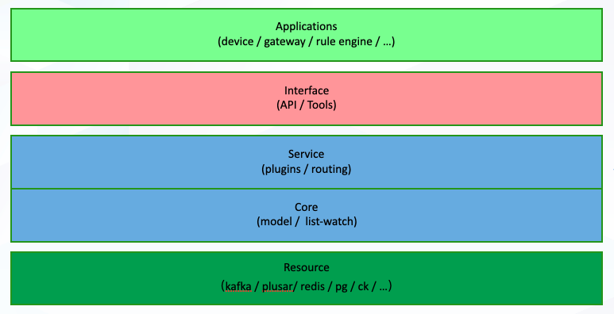

# Keel
[English](README.md)

TKeel 解决了构建高性能、模块化数据接入平台的关键要求。 它利用微服务架构模式并提供可拔插架构以及高速数据平面，帮助您快速构建健壮可复用的物联网解决方案。

## How it works

 - Core 代表了一种模式，它包含一些数据组织形式以及处理方式。
    - Core 通过时序数据、属性数据、关系数据来构建不同的对象。节点的唯一性由 ID 来保证
    - 通过 快照+订阅（Event数据） 来解决数据交换。
 - Service 提供应用可拔插能力以及核心功能（消息路由、租户管理、权限控制）。
 - Interface 封装并提供简易的工具以及开发接口供 Application 使用
 - Application 是各类应用，通过Core以及Service来实现各类应用开发。

## Why TKeel?

### Keep Simply
TKeel 开源接入框架基于物联网经验总结，通过数据平面处理分布式系统的复杂性。
TKeel处理分布式系统的复杂性，并提供更简单的可编程抽象来快速构建物联网解决方案。

### Microservice, any language
TKeel 开源物联网基于微服务架构构建，非厂商绑定且提供可扩展、可靠和高性能的伴随开发方法。
通过sidecar形式提供更简单的可编程抽象，通过http以及gRPC来通信。
平台使您的代码不受托管环境和应用程序高度可移植性的影响变得容易，可以采用任何语言来实现插件。

### Pluggable
插件基于OpenAPI约定，基于云原生方式使得部署方式上没有限制。
平台使您的代码不受托管环境和应用程序高度可移植性的影响变得容易。

通过插件机制可以方便的将您的应用复用、模块化。使得应用应对各种解决方案。
实现插件非常的简单，企业可以继续利用原有应用能力。

### Forcus on data
TKeel 开源物联网基础平台关注于数据实体。
通过实体抽象可以对真实世界进行定义，
通过配置关系映射可以提供高速的数据处理模式。

通过数据实体我们可以同时适应消息、测点、对象以及关系等种抽象，提供更多层次以及多纬度的数据服务。
通过配置关系映射用户无需记忆复杂的Topic以及消息格式即可提供高性能的数据处理解决方案。

## Getting Started

* See the [quickstarts repository](https://github.com/tkeel-io/cli#) for code examples that can help you get started with TKeel.
* Explore additional samples in the TKeel plugin [samples repository](https://github.com/tkeel-io/tkeel/tree/master/demo).

## Community
We want your contributions and suggestions!
The [community](docs/development/README.md) walks you through how to get started contributing keel.

### Contributing to TKeel

See the [development guide](docs/development/developing-tkeel.md) explains how to set up development environment.

Please submit any keel bugs, issues, and feature requests to [keel GitHub Issue](https://github.com/tkeel-io/keel/issues)

## Repositories

| Repo | Description |
|:-----|:------------|
| [TKeel](https://github.com/tkeel-io/tkeel) | The main repository that you are currently in. Contains the TKeel platform code and overview documentation.
| [CLI](https://github.com/tkeel-io/cli) | The TKeel CLI allows you to setup TKeel on your local dev machine or on a Kubernetes cluster, provides debugging support, launches and manages TKeel instances.
| [Helm](https://github.com/tkeel-io/helm-charts) | Helm charts for TKeel

## Code of Conduct

Please refer to our [TKeel Community Code of Conduct](docs/community/code-of-conduct.md)
